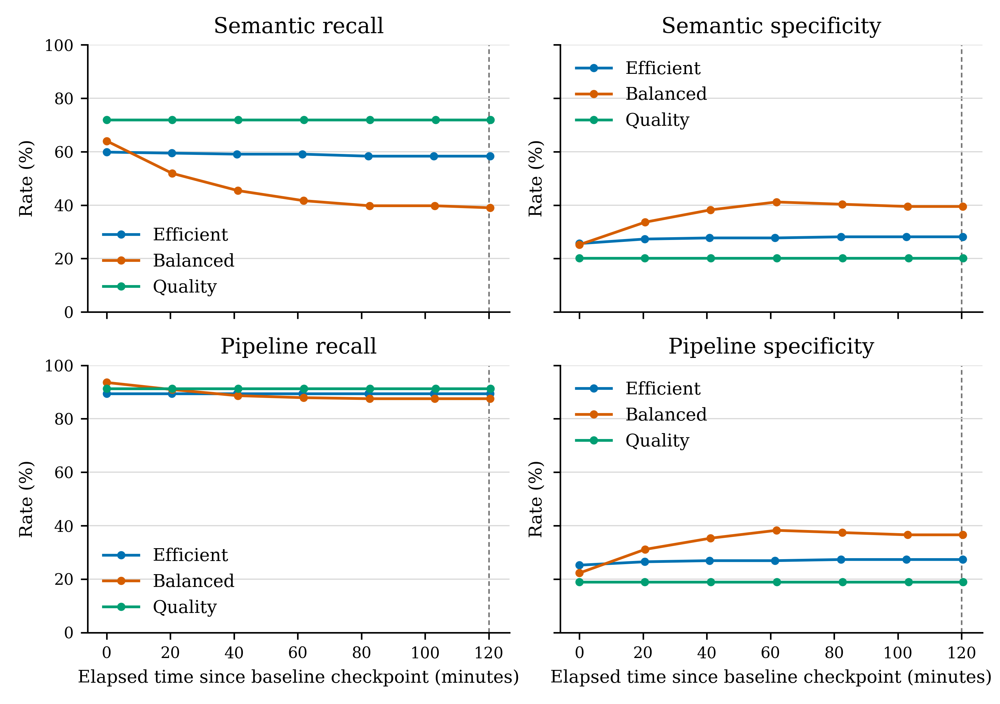

# Six hour synthetic fuzzer study results

The six-hour study completed three sequential two-hour training windows using the efficient, balanced and quality profiles. Across 1,220 attempts, it accepted 658 updates and rejected 562. It produced mixed changes on the repeated binary annotation-presence development endpoint, including a substantial recall loss for the balanced profile. These results do not qualify or promote a model and do not establish contextual privacy-policy accuracy.

## Study design and evidence

Each profile received a two-hour elapsed training window with 15-second pauses between requests, mining and checkpoint work included. The complete supervisor run started at 2026-10-09 04:30:35 UTC and finished at 10:34:36 UTC. Per-profile window bounds and checkpoint measurement times are recorded in the [aggregate provenance](evidence/long-fuzzer-20261009/provenance.json). The final checkpoint measurements occurred shortly after their two-hour windows ended.

The controller issued repeated gRPC requests with automatic deployment training disabled. Prompts were procedurally prepared before the run from the same fixed synthetic curriculum; each request reused a finite pool rather than generating fresh novel text. Each request allocated 192 distinct TRAIN rows and 64 distinct REPLAY rows, disjoint within that batch. The independent audit and root-side SQLite reconciliation verified this invariant for all 1,220 attempts. Each profile reused a finite pool of 672 TRAIN rows and 64 replay anchors. Across its repeated requests, each profile exposed every role repeatedly; exposures are counts of row appearances, not unique examples.

| Profile | Attempts | Accepted | Rejected | Unique TRAIN / REPLAY rows | Exposures per role (grammar, teacher, evolved, replay) |
| --- | ---: | ---: | ---: | ---: | ---: |
| Efficient | 399 | 317 | 82 | 672 / 64 | 25,536 each |
| Balanced | 385 | 340 | 45 | 672 / 64 | 24,640 each |
| Quality | 436 | 1 | 435 | 672 / 64 | 27,904 each |

| Profile | Elapsed window (UTC) | Final checkpoint measured (UTC) |
| --- | --- | --- |
| Efficient | 04:31:28–06:31:28 | 06:31:50 |
| Balanced | 06:32:48–08:32:48 | 08:33:11 |
| Quality | 08:34:00–10:34:00 | 10:34:31 |

Every rejected response reported `FAILED_PRECONDITION` with “Candidate model is worse on the held-out evaluation set.” The fixed publication guard contained eight sensitive and eight clean examples and was reused throughout the study. The last accepted balanced update recorded 7/8 sensitive detections and 7/8 clean cases on this guard, while balanced semantic recall on the development endpoint declined by 25 percentage points. This small fixed gate does not establish generalization. The final quality profile retained only one update; its unchanged sampled predictions do not establish equivalence beyond these endpoint rows.

The curriculum combined grammar, offline assistant-authored teacher paraphrases and fact-preserving evolved variants under provisional contextual labels. Training was head-only with a frozen encoder, learning rate 0.003, replay weight 0.35 and no text transformations. All 21 checkpoints (seven per profile) measured semantic and pipeline predictions on the same 502 development rows (264 positive, 238 negative), grouped into 465 source groups; all had zero runtime errors. These endpoint labels differ from the contextual sensitivity, visibility and category targets used for training. Repeated checkpoint measurements reuse those same 502 rows and do not increase the independent sample size.

## Baseline and final endpoint results

Rates are percentages; confusion counts are TP/TN/FP/FN. Recall and specificity changes are paired baseline-to-final differences in percentage points with 95% source-group bootstrap intervals (2,000 resamples, seed 1337). These intervals are exploratory and unadjusted for the multiple profiles, layers, checkpoints and metrics. They do not measure variability across training seeds.

| Profile | Layer | Accepted / attempts | TP/TN/FP/FN, baseline → final | Recall, baseline → final (change; 95% interval) | Specificity, baseline → final (change; 95% interval) |
| --- | --- | ---: | --- | --- | --- |
| Efficient | Semantic | 317 / 399 | 158/61/177/106 → 154/67/171/110 | 59.85 → 58.33 (−1.52; −3.33 to −0.36) | 25.63 → 28.15 (+2.52; +0.83 to +4.61) |
| Efficient | Full pipeline | 317 / 399 | 236/60/178/28 → 236/65/173/28 | 89.39 → 89.39 (0.00; 0.00 to 0.00) | 25.21 → 27.31 (+2.10; +0.44 to +4.05) |
| Balanced | Semantic | 340 / 385 | 169/60/178/95 → 103/94/144/161 | 64.02 → 39.02 (−25.00; −30.12 to −19.78) | 25.21 → 39.50 (+14.29; +9.24 to +19.09) |
| Balanced | Full pipeline | 340 / 385 | 247/53/185/17 → 231/87/151/33 | 93.56 → 87.50 (−6.06; −9.12 to −3.27) | 22.27 → 36.55 (+14.29; +9.39 to +18.94) |
| Quality | Semantic | 1 / 436 | 190/48/190/74 → 190/48/190/74 | 71.97 → 71.97 (0.00; 0.00 to 0.00) | 20.17 → 20.17 (0.00; 0.00 to 0.00) |
| Quality | Full pipeline | 1 / 436 | 241/45/193/23 → 241/45/193/23 | 91.29 → 91.29 (0.00; 0.00 to 0.00) | 18.91 → 18.91 (0.00; 0.00 to 0.00) |

The balanced pipeline gained 14.29 points of specificity, removing 34 false positives, but its recall fell by 6.06 points as it added 16 false negatives; final specificity was 36.55% with 33 false negatives. Its F1 changed from 70.98% to 71.52% (+0.54 points; 95% interval −1.49 to +2.46), which includes no change. The semantic endpoint lost 66 true positives. The efficient semantic layer gained 2.52 points of specificity and lost 1.52 points of recall, while its pipeline recall was unchanged. Final pipeline specificity remained 27.31% for efficient and 18.91% for quality. The single accepted quality update changed weights but none of the measured endpoint predictions; this does not establish equivalence outside these sampled predictions.

The final semantic and pipeline predictions changed on 10 and 5 binary rows for efficient, 108 and 54 for balanced, and zero for quality. Contextual classifications changed on 51 and 39 rows for efficient and 256 and 190 for balanced. These are output-change counts, not contextual correctness measurements.



Each panel shows all archived checkpoints, with the baseline at zero minutes and later points positioned by their measured UTC timestamps. The efficient profile's key endpoint values reached a plateau by the checkpoint after attempt 266. Balanced semantic recall and F1 continued downward through the final checkpoint; balanced pipeline specificity, precision, F1, accuracy and balanced accuracy were higher at checkpoint 193 before easing back to a final plateau. The plot retains the final protocol checkpoint and does not select an earlier checkpoint post hoc.

## Interpretation and limitations

This was a single trajectory per profile, with no matched old-sampler control or component ablation. The combined treatment does not isolate grammar, teacher paraphrases, evolution, replay or mining. The finite curriculum was reused; the number of exposures must not be read as the number of independent training examples. The accepted-update count is distinct from endpoint quality, and a rejected candidate's response does not expose its candidate metrics. The observed changes are conditional on this training sequence, fixed endpoint, profile and publication gate.

The study does not establish that the balanced specificity gain outweighs its recall loss, that the quality profile is unchanged beyond the sampled endpoint, or that any profile is safer for contextual privacy decisions. It provides no basis for model promotion or a claim of improvement over the old sampler. Independent contextual-label adjudication, matched controls, training-seed replication and protected final evaluation remain separate work.

## Reproduction and evidence

The [summary](evidence/long-fuzzer-20261009/summary.json) contains aggregate endpoint counts, checkpoint metrics and paired intervals. The [independent audit](evidence/long-fuzzer-20261009/independent-audit.json) passed the six-hour protocol, archived round and publication-chain checks, and 72 paired metric checks per profile. The [frozen protocol](evidence/long-fuzzer-20261009/protocol.json) and [safe provenance record](evidence/long-fuzzer-20261009/provenance.json) retain input commitments, time bounds, checkpoint times, serving image identities and source hashes. The provenance record contains aggregate metadata only; the published evidence set omits raw prompts, row IDs, predictions and model weights.

From the repository root, verify the report's plot inputs and regenerate the figure with:

```powershell
python paper/scripts/plot_long_fuzzer_trajectories.py --validate-only
python paper/scripts/plot_long_fuzzer_trajectories.py --overwrite
```

The study audit is reproducible from the archived study outputs with `python evaluation/audit-long-fuzzer-study.py --study-root evaluation/results/long_fuzzer_20261009`. A new experiment must use a fresh output directory and unique study ID as described in the [evaluation instructions](../evaluation/README.md#continual-synthetic-fuzzer-study); the completed directory must not be reused for another run.
